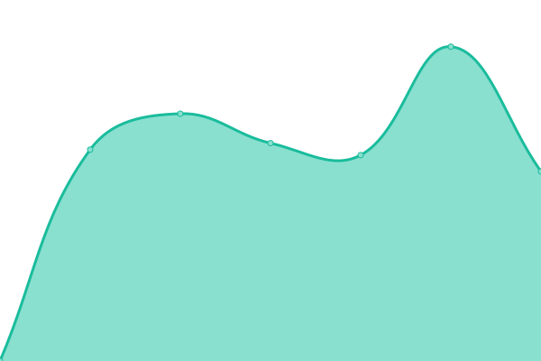

# [📈 Live Status](https://mo.mrlin.me): <!--live status--> **🟧 Partial outage**

This repository contains the open-source uptime monitor and status page for [sterling](https://mo.mrlin.me), powered by [Upptime](https://github.com/upptime/upptime).

With [Upptime](https://upptime.js.org), you can get your own unlimited and free uptime monitor and status page, powered entirely by a GitHub repository. We use [Issues](https://github.com/lzh-zone/lin-uptime/issues) as incident reports, [Actions](https://github.com/lzh-zone/lin-uptime/actions) as uptime monitors, and [Pages](https://mo.mrlin.me) for the status page.

<!--start: status pages-->
<!-- This summary is generated by Upptime (https://github.com/upptime/upptime) -->
<!-- Do not edit this manually, your changes will be overwritten -->
<!-- prettier-ignore -->
| URL | Status | History | Response Time | Uptime |
| --- | ------ | ------- | ------------- | ------ |
|  [监控页](https://lzhnb.cf) | 🟩 Up | [.yml](https://github.com/lzh-zone/lin-uptime/commits/HEAD/history/.yml) | 

 322ms
     
 | 

<a href="https://mo.mrlin.me/history/">96.81%</a>
    

|  [blog](https://blog.lzhnb.cf) | 🟩 Up | [blog.yml](https://github.com/lzh-zone/lin-uptime/commits/HEAD/history/blog.yml) | 

 312ms
     
 | 

<a href="https://mo.mrlin.me/history/blog">100.00%</a>
    

|  [blogn](https://new.lzhnb.cf) | 🟩 Up | [blogn.yml](https://github.com/lzh-zone/lin-uptime/commits/HEAD/history/blogn.yml) | 

 317ms
     
 | 

<a href="https://mo.mrlin.me/history/blogn">100.00%</a>
    

|  [影视1](https://z.lzh1.eu.org) | 🟩 Up | [1.yml](https://github.com/lzh-zone/lin-uptime/commits/HEAD/history/1.yml) | 

 2335ms
     
 | 

<a href="https://mo.mrlin.me/history/1">97.76%</a>
    

|  [影视2](https://fei.lzhpri.tk) | 🟩 Up | [2.yml](https://github.com/lzh-zone/lin-uptime/commits/HEAD/history/2.yml) | 

 690ms
     
 | 

<a href="https://mo.mrlin.me/history/2">99.07%</a>
    

|  [yu1](https://xiaoyuer.tv/api.php/timming/index.html?enforce=1&name=aa) | 🟩 Up | [yu1.yml](https://github.com/lzh-zone/lin-uptime/commits/HEAD/history/yu1.yml) | 

 7994ms
     
 | 

<a href="https://mo.mrlin.me/history/yu1">100.00%</a>
    

|  [yu2](https://xiaoyuer.tv/api.php/timming/index.html?enforce=1&name=bb) | 🟩 Up | [yu2.yml](https://github.com/lzh-zone/lin-uptime/commits/HEAD/history/yu2.yml) | 

 8894ms
     
 | 

<a href="https://mo.mrlin.me/history/yu2">100.00%</a>
    

|  [free.nl.eu.org-ff](https://free.nl.eu.org/api.php/timming/index.html?enforce=1&name=093a8fb6e9ff09dabd984a30349bd5e2collect01) | 🟥 Down | [free-nl-eu-org-ff.yml](https://github.com/lzh-zone/lin-uptime/commits/HEAD/history/free-nl-eu-org-ff.yml) | 

 480ms
     
 | 

<a href="https://mo.mrlin.me/history/free-nl-eu-org-ff">0.00%</a>
    

|  [free.nl.eu.org-hy](https://free.nl.eu.org/api.php/timming/index.html?enforce=1&name=8b1572c70defb898e69519f7abc2d36bcollect04) | 🟥 Down | [free-nl-eu-org-hy.yml](https://github.com/lzh-zone/lin-uptime/commits/HEAD/history/free-nl-eu-org-hy.yml) | 

 146ms
     
 | 

<a href="https://mo.mrlin.me/history/free-nl-eu-org-hy">0.00%</a>
    

|  [free.nl.eu.org-lz](https://free.nl.eu.org/api.php/timming/index.html?enforce=1&name=cc427cd482f68237e1b77e5f11a1e28acollect09) | 🟥 Down | [free-nl-eu-org-lz.yml](https://github.com/lzh-zone/lin-uptime/commits/HEAD/history/free-nl-eu-org-lz.yml) | 

 147ms
     
 | 

<a href="https://mo.mrlin.me/history/free-nl-eu-org-lz">0.00%</a>
    

|  [free.nl.eu.org-hn](https://free.nl.eu.org/api.php/timming/index.html?enforce=1&name=5ea090f24f65a22bd9b9c8737ee53872collect12) | 🟥 Down | [free-nl-eu-org-hn.yml](https://github.com/lzh-zone/lin-uptime/commits/HEAD/history/free-nl-eu-org-hn.yml) | 

 146ms
     
 | 

<a href="https://mo.mrlin.me/history/free-nl-eu-org-hn">1.42%</a>
    

|  [free.nl.eu.org-hh](https://free.nl.eu.org/api.php/timming/index.html?enforce=1&name=huohuzyzanzhu09) | 🟥 Down | [free-nl-eu-org-hh.yml](https://github.com/lzh-zone/lin-uptime/commits/HEAD/history/free-nl-eu-org-hh.yml) | 

 145ms
     
 | 

<a href="https://mo.mrlin.me/history/free-nl-eu-org-hh">0.00%</a>
    

|  [free.nl.eu.org-js](https://free.nl.eu.org/api.php/timming/index.html?enforce=1&name=jisuzyzanzhu14) | 🟥 Down | [free-nl-eu-org-js.yml](https://github.com/lzh-zone/lin-uptime/commits/HEAD/history/free-nl-eu-org-js.yml) | 

 146ms
     
 | 

<a href="https://mo.mrlin.me/history/free-nl-eu-org-js">6.01%</a>
    

|  [free.nl.eu.org-sl](https://free.nl.eu.org/api.php/timming/index.html?enforce=1&name=senlinzyzanzhu12) | 🟥 Down | [free-nl-eu-org-sl.yml](https://github.com/lzh-zone/lin-uptime/commits/HEAD/history/free-nl-eu-org-sl.yml) | 

 150ms
     
 | 

<a href="https://mo.mrlin.me/history/free-nl-eu-org-sl">0.00%</a>
    

<!--end: status pages-->

[**Visit our status website →**](https://mo.mrlin.me)

## 📄 License

- Powered by: [Upptime](https://github.com/upptime/upptime)
- Code: [MIT](./LICENSE) © [sterling](https://mo.mrlin.me)
- Data in the `./history` directory: [Open Database License](https://opendatacommons.org/licenses/odbl/1-0/)
