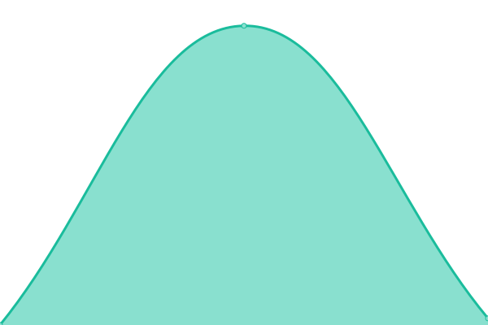

# [📈 Live Status](https://mo.mrlin.me): <!--live status--> **🟩 All systems operational**

This repository contains the open-source uptime monitor and status page for [sterling](https://mo.mrlin.me), powered by [Upptime](https://github.com/upptime/upptime).

With [Upptime](https://upptime.js.org), you can get your own unlimited and free uptime monitor and status page, powered entirely by a GitHub repository. We use [Issues](https://github.com/lzh-zone/lin-uptime/issues) as incident reports, [Actions](https://github.com/lzh-zone/lin-uptime/actions) as uptime monitors, and [Pages](https://mo.mrlin.me) for the status page.

<!--start: status pages-->
<!-- This summary is generated by Upptime (https://github.com/upptime/upptime) -->
<!-- Do not edit this manually, your changes will be overwritten -->
<!-- prettier-ignore -->
| URL | Status | History | Response Time | Uptime |
| --- | ------ | ------- | ------------- | ------ |
|  [监控页](https://lzhnb.cf) | 🟩 Up | [.yml](https://github.com/lzh-zone/lin-uptime/commits/HEAD/history/.yml) | 

 361ms
     
 | 

<a href="https://mo.mrlin.me/history/">0.00%</a>
    

|  [blog](https://blog.lzhnb.cf) | 🟩 Up | [blog.yml](https://github.com/lzh-zone/lin-uptime/commits/HEAD/history/blog.yml) | 

 405ms
     
 | 

<a href="https://mo.mrlin.me/history/blog">100.00%</a>
    

|  [blogn](https://new.lzhnb.cf) | 🟩 Up | [blogn.yml](https://github.com/lzh-zone/lin-uptime/commits/HEAD/history/blogn.yml) | 

 309ms
     
 | 

<a href="https://mo.mrlin.me/history/blogn">100.00%</a>
    

|  [影视1](https://z.lzh1.eu.org) | 🟩 Up | [1.yml](https://github.com/lzh-zone/lin-uptime/commits/HEAD/history/1.yml) | 

 2674ms
     
 | 

<a href="https://mo.mrlin.me/history/1">100.00%</a>
    

|  [影视2](https://fei.lzhpri.tk) | 🟩 Up | [2.yml](https://github.com/lzh-zone/lin-uptime/commits/HEAD/history/2.yml) | 

 665ms
     
 | 

<a href="https://mo.mrlin.me/history/2">12.82%</a>
    

|  [wzd.nl.eu.org1](https://wzd.nl.eu.org/api.php/timming/index.html?enforce=1&name=093a8fb6e9ff09dabd984a30349bd5e2collect01) | 🟩 Up | [wzd-nl-eu-org1.yml](https://github.com/lzh-zone/lin-uptime/commits/HEAD/history/wzd-nl-eu-org1.yml) | 

 5668ms
     
 | 

<a href="https://mo.mrlin.me/history/wzd-nl-eu-org1">100.00%</a>
    

|  [wzd.nl.eu.org2](https://wzd.nl.eu.org/api.php/timming/index.html?enforce=1&name=0a48481f0112b8fb9aacf021283a0df2collect02) | 🟩 Up | [wzd-nl-eu-org2.yml](https://github.com/lzh-zone/lin-uptime/commits/HEAD/history/wzd-nl-eu-org2.yml) | 

 1732ms
     
 | 

<a href="https://mo.mrlin.me/history/wzd-nl-eu-org2">100.00%</a>
    

|  [wzd.nl.eu.org3](https://wzd.nl.eu.org/api.php/timming/index.html?enforce=1&name=8b1572c70defb898e69519f7abc2d36bcollect04) | 🟩 Up | [wzd-nl-eu-org3.yml](https://github.com/lzh-zone/lin-uptime/commits/HEAD/history/wzd-nl-eu-org3.yml) | 

 10354ms
     
 | 

<a href="https://mo.mrlin.me/history/wzd-nl-eu-org3">100.00%</a>
    

|  [wzd.nl.eu.org5](https://wzd.nl.eu.org/api.php/timming/index.html?enforce=1&name=cc427cd482f68237e1b77e5f11a1e28acollect09) | 🟩 Up | [wzd-nl-eu-org5.yml](https://github.com/lzh-zone/lin-uptime/commits/HEAD/history/wzd-nl-eu-org5.yml) | 

 6578ms
     
 | 

<a href="https://mo.mrlin.me/history/wzd-nl-eu-org5">100.00%</a>
    

|  [wzd.nl.eu.org6](https://wzd.nl.eu.org/api.php/timming/index.html?enforce=1&name=5f3323ed75bfe5b68816eae2c3a7ef92collect10) | 🟩 Up | [wzd-nl-eu-org6.yml](https://github.com/lzh-zone/lin-uptime/commits/HEAD/history/wzd-nl-eu-org6.yml) | 

 3473ms
     
 | 

<a href="https://mo.mrlin.me/history/wzd-nl-eu-org6">100.00%</a>
    

|  [wzd.nl.eu.org7](https://wzd.nl.eu.org/api.php/timming/index.html?enforce=1&name=5ea090f24f65a22bd9b9c8737ee53872collect12) | 🟩 Up | [wzd-nl-eu-org7.yml](https://github.com/lzh-zone/lin-uptime/commits/HEAD/history/wzd-nl-eu-org7.yml) | 

 5799ms
     
 | 

<a href="https://mo.mrlin.me/history/wzd-nl-eu-org7">100.00%</a>
    

|  [wzd.nl.eu.org8](https://wzd.nl.eu.org/api.php/timming/index.html?enforce=1&name=1ced0df221b04bcb75b0f24e04e8fd10collect13) | 🟩 Up | [wzd-nl-eu-org8.yml](https://github.com/lzh-zone/lin-uptime/commits/HEAD/history/wzd-nl-eu-org8.yml) | 

 2239ms
     
 | 

<a href="https://mo.mrlin.me/history/wzd-nl-eu-org8">100.00%</a>
    

|  [wzd.nl.eu.org9](https://wzd.nl.eu.org/api.php/timming/index.html?enforce=1&name=1ced0df221b04bcb75b0f24e04e8fd10collect13) | 🟩 Up | [wzd-nl-eu-org9.yml](https://github.com/lzh-zone/lin-uptime/commits/HEAD/history/wzd-nl-eu-org9.yml) | 

 2261ms
     
 | 

<a href="https://mo.mrlin.me/history/wzd-nl-eu-org9">100.00%</a>
    

|  [wzd.nl.eu.org10](https://wzd.nl.eu.org/api.php/timming/index.html?enforce=1&name=45f33b701d9ec5f355ffb35e51e2a37dcollect03) | 🟩 Up | [wzd-nl-eu-org10.yml](https://github.com/lzh-zone/lin-uptime/commits/HEAD/history/wzd-nl-eu-org10.yml) | 

 16931ms
     
 | 

<a href="https://mo.mrlin.me/history/wzd-nl-eu-org10">92.25%</a>
    

|  [wzd.nl.eu.org11](https://wzd.nl.eu.org/api.php/timming/index.html?enforce=1&name=bominzyzanzhu16) | 🟩 Up | [wzd-nl-eu-org11.yml](https://github.com/lzh-zone/lin-uptime/commits/HEAD/history/wzd-nl-eu-org11.yml) | 

 8792ms
     
 | 

<a href="https://mo.mrlin.me/history/wzd-nl-eu-org11">100.00%</a>
    

|  [wzd.nl.eu.org12](https://wzd.nl.eu.org/api.php/timming/index.html?enforce=1&name=senlinzyzanzhu13) | 🟩 Up | [wzd-nl-eu-org12.yml](https://github.com/lzh-zone/lin-uptime/commits/HEAD/history/wzd-nl-eu-org12.yml) | 

 14678ms
     
 | 

<a href="https://mo.mrlin.me/history/wzd-nl-eu-org12">27.55%</a>
    

|  [netflix.nl.eu.org1](https://netflix.nl.eu.org/api.php/timming/index.html?enforce=1&name=093a8fb6e9ff09dabd984a30349bd5e2collect01) | 🟩 Up | [netflix-nl-eu-org1.yml](https://github.com/lzh-zone/lin-uptime/commits/HEAD/history/netflix-nl-eu-org1.yml) | 

 6391ms
     
 | 

<a href="https://mo.mrlin.me/history/netflix-nl-eu-org1">100.00%</a>
    

|  [netflix.nl.eu.org2](https://netflix.nl.eu.org/api.php/timming/index.html?enforce=1&name=0a48481f0112b8fb9aacf021283a0df2collect02) | 🟩 Up | [netflix-nl-eu-org2.yml](https://github.com/lzh-zone/lin-uptime/commits/HEAD/history/netflix-nl-eu-org2.yml) | 

 1361ms
     
 | 

<a href="https://mo.mrlin.me/history/netflix-nl-eu-org2">100.00%</a>
    

|  [netflix.nl.eu.org3](https://netflix.nl.eu.org/api.php/timming/index.html?enforce=1&name=8b1572c70defb898e69519f7abc2d36bcollect04) | 🟩 Up | [netflix-nl-eu-org3.yml](https://github.com/lzh-zone/lin-uptime/commits/HEAD/history/netflix-nl-eu-org3.yml) | 

 7738ms
     
 | 

<a href="https://mo.mrlin.me/history/netflix-nl-eu-org3">100.00%</a>
    

|  [netflix.nl.eu.org4](https://netflix.nl.eu.org/api.php/timming/index.html?enforce=1&name=cc427cd482f68237e1b77e5f11a1e28acollect09) | 🟩 Up | [netflix-nl-eu-org4.yml](https://github.com/lzh-zone/lin-uptime/commits/HEAD/history/netflix-nl-eu-org4.yml) | 

 3406ms
     
 | 

<a href="https://mo.mrlin.me/history/netflix-nl-eu-org4">100.00%</a>
    

|  [netflix.nl.eu.org5](https://netflix.nl.eu.org/api.php/timming/index.html?enforce=1&name=5ea090f24f65a22bd9b9c8737ee53872collect12) | 🟩 Up | [netflix-nl-eu-org5.yml](https://github.com/lzh-zone/lin-uptime/commits/HEAD/history/netflix-nl-eu-org5.yml) | 

 5753ms
     
 | 

<a href="https://mo.mrlin.me/history/netflix-nl-eu-org5">100.00%</a>
    

|  [netflix.nl.eu.org6](https://netflix.nl.eu.org/api.php/timming/index.html?enforce=1&name=senlinzyzanzhu12) | 🟩 Up | [netflix-nl-eu-org6.yml](https://github.com/lzh-zone/lin-uptime/commits/HEAD/history/netflix-nl-eu-org6.yml) | 

 19401ms
     
 | 

<a href="https://mo.mrlin.me/history/netflix-nl-eu-org6">28.55%</a>
    

|  [netflix.nl.eu.org7](https://netflix.nl.eu.org/api.php/timming/index.html?enforce=1&name=hgzyzanzhu18) | 🟩 Up | [netflix-nl-eu-org7.yml](https://github.com/lzh-zone/lin-uptime/commits/HEAD/history/netflix-nl-eu-org7.yml) | 

 521ms
     
 | 

<a href="https://mo.mrlin.me/history/netflix-nl-eu-org7">100.00%</a>
    

|  [netflix.nl.eu.org8](https://netflix.nl.eu.org/api.php/timming/index.html?enforce=1&name=bominzyzanzhu15) | 🟩 Up | [netflix-nl-eu-org8.yml](https://github.com/lzh-zone/lin-uptime/commits/HEAD/history/netflix-nl-eu-org8.yml) | 

 7529ms
     
 | 

<a href="https://mo.mrlin.me/history/netflix-nl-eu-org8">100.00%</a>
    

<!--end: status pages-->

[**Visit our status website →**](https://mo.mrlin.me)

## 📄 License

- Powered by: [Upptime](https://github.com/upptime/upptime)
- Code: [MIT](./LICENSE) © [sterling](https://mo.mrlin.me)
- Data in the `./history` directory: [Open Database License](https://opendatacommons.org/licenses/odbl/1-0/)
