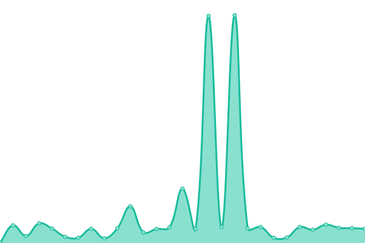

# [📈 Live Status](https://mo.mrlin.me): <!--live status--> **🟧 Partial outage**

This repository contains the open-source uptime monitor and status page for [sterling](https://mo.mrlin.me), powered by [Upptime](https://github.com/upptime/upptime).

With [Upptime](https://upptime.js.org), you can get your own unlimited and free uptime monitor and status page, powered entirely by a GitHub repository. We use [Issues](https://github.com/lzh-zone/lin-uptime/issues) as incident reports, [Actions](https://github.com/lzh-zone/lin-uptime/actions) as uptime monitors, and [Pages](https://mo.mrlin.me) for the status page.

<!--start: status pages-->
<!-- This summary is generated by Upptime (https://github.com/upptime/upptime) -->
<!-- Do not edit this manually, your changes will be overwritten -->
<!-- prettier-ignore -->
| URL | Status | History | Response Time | Uptime |
| --- | ------ | ------- | ------------- | ------ |
|  [监控页](https://lzhnb.cf) | 🟩 Up | [.yml](https://github.com/lzh-zone/lin-uptime/commits/HEAD/history/.yml) | 

 373ms
     
 | 

<a href="https://mo.mrlin.me/history/">0.00%</a>
    

|  [blog](https://blog.lzhnb.cf) | 🟩 Up | [blog.yml](https://github.com/lzh-zone/lin-uptime/commits/HEAD/history/blog.yml) | 

 340ms
     
 | 

<a href="https://mo.mrlin.me/history/blog">100.00%</a>
    

|  [blogn](https://new.lzhnb.cf) | 🟩 Up | [blogn.yml](https://github.com/lzh-zone/lin-uptime/commits/HEAD/history/blogn.yml) | 

 415ms
     
 | 

<a href="https://mo.mrlin.me/history/blogn">100.00%</a>
    

|  [影视1](https://z.lzh1.eu.org) | 🟥 Down | [1.yml](https://github.com/lzh-zone/lin-uptime/commits/HEAD/history/1.yml) | 

 3293ms
     
 | 

<a href="https://mo.mrlin.me/history/1">96.22%</a>
    

|  [影视2](https://h.lzhnb.gay) | 🟥 Down | [2.yml](https://github.com/lzh-zone/lin-uptime/commits/HEAD/history/2.yml) | 

 1059ms
     
 | 

<a href="https://mo.mrlin.me/history/2">28.31%</a>
    

|  [影视3](https://tv.mrlin.me) | 🟥 Down | [3.yml](https://github.com/lzh-zone/lin-uptime/commits/HEAD/history/3.yml) | 

 529ms
     
 | 

<a href="https://mo.mrlin.me/history/3">71.10%</a>
    

|  [影视4](https://fei.lzhpri.tk) | 🟩 Up | [4.yml](https://github.com/lzh-zone/lin-uptime/commits/HEAD/history/4.yml) | 

 1027ms
     
 | 

<a href="https://mo.mrlin.me/history/4">99.55%</a>
    

|  [影视5](https://lzhnb.now.cc) | 🟥 Down | [5.yml](https://github.com/lzh-zone/lin-uptime/commits/HEAD/history/5.yml) | 

 914ms
     
 | 

<a href="https://mo.mrlin.me/history/5">70.76%</a>
    

<!--end: status pages-->

[**Visit our status website →**](https://mo.mrlin.me)

## 📄 License

- Powered by: [Upptime](https://github.com/upptime/upptime)
- Code: [MIT](./LICENSE) © [sterling](https://mo.mrlin.me)
- Data in the `./history` directory: [Open Database License](https://opendatacommons.org/licenses/odbl/1-0/)
