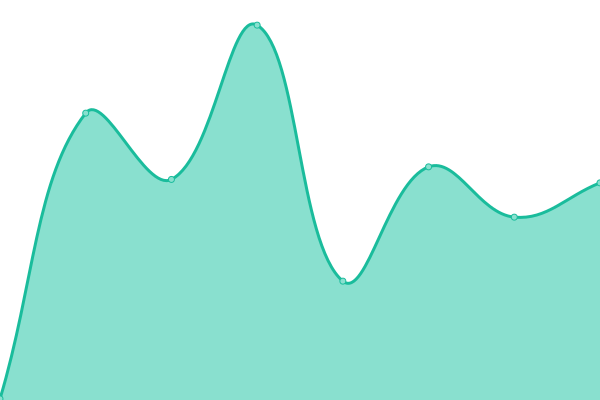

# [📈 Live Status](https://mo.mrlin.me): <!--live status--> **🟩 All systems operational**

This repository contains the open-source uptime monitor and status page for [sterling](https://mo.mrlin.me), powered by [Upptime](https://github.com/upptime/upptime).

With [Upptime](https://upptime.js.org), you can get your own unlimited and free uptime monitor and status page, powered entirely by a GitHub repository. We use [Issues](https://github.com/lzh-zone/lin-uptime/issues) as incident reports, [Actions](https://github.com/lzh-zone/lin-uptime/actions) as uptime monitors, and [Pages](https://mo.mrlin.me) for the status page.

<!--start: status pages-->
<!-- This summary is generated by Upptime (https://github.com/upptime/upptime) -->
<!-- Do not edit this manually, your changes will be overwritten -->
<!-- prettier-ignore -->
| URL | Status | History | Response Time | Uptime |
| --- | ------ | ------- | ------------- | ------ |
|  [LZH-ZONE主页](https://010702.xyz/) | 🟩 Up | [lzh-zone.yml](https://github.com/lzh-zone/lin-uptime/commits/HEAD/history/lzh-zone.yml) | 

 246ms
     
 | 

<a href="https://mo.010702.xyz/history/lzh-zone">100.00%</a>
    

|  [blog](https://blog.010702.xyz) | 🟩 Up | [blog.yml](https://github.com/lzh-zone/lin-uptime/commits/HEAD/history/blog.yml) | 

 264ms
     
 | 

<a href="https://mo.010702.xyz/history/blog">100.00%</a>
    

|  [notion](https://log.010702.xyz/) | 🟩 Up | [notion.yml](https://github.com/lzh-zone/lin-uptime/commits/HEAD/history/notion.yml) | 

 968ms
     
 | 

<a href="https://mo.010702.xyz/history/notion">100.00%</a>
    

|  [Z-MOONTV](https://tv.linzihao.eu.org/) | 🟩 Up | [z-moontv.yml](https://github.com/lzh-zone/lin-uptime/commits/HEAD/history/z-moontv.yml) | 

 683ms
     
 | 

<a href="https://mo.010702.xyz/history/z-moontv">100.00%</a>
    

|  [毒蛇影院](https://nav.010702.xyz/) | 🟩 Up | [.yml](https://github.com/lzh-zone/lin-uptime/commits/HEAD/history/.yml) | 

 3910ms
     
 | 

<a href="https://mo.010702.xyz/history/">0.00%</a>
    

|  [FC影院](https://v.872888.xyz/) | 🟩 Up | [fc.yml](https://github.com/lzh-zone/lin-uptime/commits/HEAD/history/fc.yml) | 

 415ms
     
 | 

<a href="https://mo.010702.xyz/history/fc">100.00%</a>
    

|  [Image](https://pic.010702.xyz/) | 🟩 Up | [image.yml](https://github.com/lzh-zone/lin-uptime/commits/HEAD/history/image.yml) | 

 916ms
     
 | 

<a href="https://mo.010702.xyz/history/image">100.00%</a>
    

<!--end: status pages-->

[**Visit our status website →**](https://mo.mrlin.me)

## 📄 License

- Powered by: [Upptime](https://github.com/upptime/upptime)
- Code: [MIT](./LICENSE) © [sterling](https://mo.mrlin.me)
- Data in the `./history` directory: [Open Database License](https://opendatacommons.org/licenses/odbl/1-0/)
