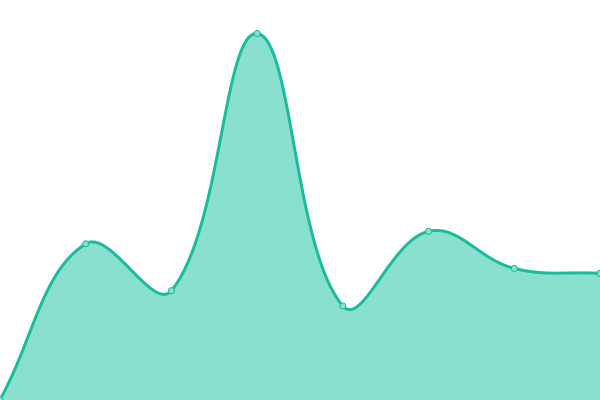

# [📈 Live Status](https://mo.mrlin.me): <!--live status--> **🟧 Partial outage**

This repository contains the open-source uptime monitor and status page for [sterling](https://mo.mrlin.me), powered by [Upptime](https://github.com/upptime/upptime).

With [Upptime](https://upptime.js.org), you can get your own unlimited and free uptime monitor and status page, powered entirely by a GitHub repository. We use [Issues](https://github.com/lzh-zone/lin-uptime/issues) as incident reports, [Actions](https://github.com/lzh-zone/lin-uptime/actions) as uptime monitors, and [Pages](https://mo.mrlin.me) for the status page.

<!--start: status pages-->
<!-- This summary is generated by Upptime (https://github.com/upptime/upptime) -->
<!-- Do not edit this manually, your changes will be overwritten -->
<!-- prettier-ignore -->
| URL | Status | History | Response Time | Uptime |
| --- | ------ | ------- | ------------- | ------ |
|  [lzherwr-mtp](https://lzherwr.serv00.net/h98lah.php?pwd=JvnIAvsg&cronCommand=/usr/home/lzherwr/.npm-global/bin/pm2 resurrect&timeInterval=30) | 🟥 Down | [lzherwr-mtp.yml](https://github.com/lzh-zone/lin-uptime/commits/HEAD/history/lzherwr-mtp.yml) | 

 884ms
     
 | 

<a href="https://mo.wzz.cloudns.ch/history/lzherwr-mtp">64.07%</a>
    

|  [blog](https://010702.xyz) | 🟩 Up | [blog.yml](https://github.com/lzh-zone/lin-uptime/commits/HEAD/history/blog.yml) | 

 183ms
     
 | 

<a href="https://mo.wzz.cloudns.ch/history/blog">100.00%</a>
    

|  [memo](https://memo.010702.xyz) | 🟩 Up | [memo.yml](https://github.com/lzh-zone/lin-uptime/commits/HEAD/history/memo.yml) | 

 371ms
     
 | 

<a href="https://mo.wzz.cloudns.ch/history/memo">100.00%</a>
    

|  [0702影院](https://0702.rr.nu/) | 🟥 Down | [0702.yml](https://github.com/lzh-zone/lin-uptime/commits/HEAD/history/0702.yml) | 

 1446ms
     
 | 

<a href="https://mo.wzz.cloudns.ch/history/0702">100.00%</a>
    

|  [毒蛇影院](https://ds.872888.xyz/) | 🟩 Up | [.yml](https://github.com/lzh-zone/lin-uptime/commits/HEAD/history/.yml) | 

 2114ms
     
 | 

<a href="https://mo.wzz.cloudns.ch/history/">62.08%</a>
    

|  [FC影院](https://v.872888.xyz/) | 🟩 Up | [fc.yml](https://github.com/lzh-zone/lin-uptime/commits/HEAD/history/fc.yml) | 

 83ms
     
 | 

<a href="https://mo.wzz.cloudns.ch/history/fc">100.00%</a>
    

|  [lzherwr-nezhaagent](https://lzherwr.serv00.net/h98lah.php?pwd=JvnIAvsg&cronCommand=/usr/home/lzherwr/serv00_ct8_nezha/heart_beat_entry.sh&timeInterval=5) | 🟩 Up | [lzherwr-nezhaagent.yml](https://github.com/lzh-zone/lin-uptime/commits/HEAD/history/lzherwr-nezhaagent.yml) | 

 632ms
     
 | 

<a href="https://mo.wzz.cloudns.ch/history/lzherwr-nezhaagent">100.00%</a>
    

|  [aggwrfr-nezhaagent](http://aggwrfr.serv00.net/d4w288.php?pwd=rGz8g59k&cronCommand=/usr/home/aggwrfr/serv00_ct8_nezha/heart_beat_entry.sh&timeInterval=10) | 🟩 Up | [aggwrfr-nezhaagent.yml](https://github.com/lzh-zone/lin-uptime/commits/HEAD/history/aggwrfr-nezhaagent.yml) | 

 778ms
     
 | 

<a href="https://mo.wzz.cloudns.ch/history/aggwrfr-nezhaagent">100.00%</a>
    

|  [aggwrfr-pm2](http://aggwrfr.serv00.net/d4w288.php?pwd=rGz8g59k&cronCommand=/home/aggwrfr/.npm-global/bin/pm2%20resurrect&timeInterval=30) | 🟩 Up | [aggwrfr-pm2.yml](https://github.com/lzh-zone/lin-uptime/commits/HEAD/history/aggwrfr-pm2.yml) | 

 151ms
     
 | 

<a href="https://mo.wzz.cloudns.ch/history/aggwrfr-pm2">100.00%</a>
    

|  [qweqwe-nezhaagent](https://qweqwe.serv00.net/7cszs7.php?pwd=figtQLJb&cronCommand=/usr/home/qweqwe/serv00_ct8_nezha/heart_beat_entry.sh&timeInterval=5) | 🟩 Up | [qweqwe-nezhaagent.yml](https://github.com/lzh-zone/lin-uptime/commits/HEAD/history/qweqwe-nezhaagent.yml) | 

 785ms
     
 | 

<a href="https://mo.wzz.cloudns.ch/history/qweqwe-nezhaagent">100.00%</a>
    

|  [qweqwe-pm2](https://qweqwe.serv00.net/7cszs7.php?pwd=figtQLJb&cronCommand=/home/qweqwe/.npm-global/bin/pm2%20resurrect&timeInterval=30) | 🟩 Up | [qweqwe-pm2.yml](https://github.com/lzh-zone/lin-uptime/commits/HEAD/history/qweqwe-pm2.yml) | 

 148ms
     
 | 

<a href="https://mo.wzz.cloudns.ch/history/qweqwe-pm2">100.00%</a>
    

|  [lzhaaer-nezhaagent](https://lzhaaer.serv00.net/vsbez9.php?pwd=QEiK8VoK&cronCommand=/usr/home/lzhaaer/serv00_ct8_nezha/heart_beat_entry.sh&timeInterval=5) | 🟩 Up | [lzhaaer-nezhaagent.yml](https://github.com/lzh-zone/lin-uptime/commits/HEAD/history/lzhaaer-nezhaagent.yml) | 

 456ms
     
 | 

<a href="https://mo.wzz.cloudns.ch/history/lzhaaer-nezhaagent">100.00%</a>
    

|  [zihaonb-nezhaagent](https://zihaonb.serv00.net/5n1k57.php?pwd=Za2bkDxt&cronCommand=/usr/home/zihaonb/serv00_ct8_nezha/heart_beat_entry.sh&timeInterval=5) | 🟩 Up | [zihaonb-nezhaagent.yml](https://github.com/lzh-zone/lin-uptime/commits/HEAD/history/zihaonb-nezhaagent.yml) | 

 737ms
     
 | 

<a href="https://mo.wzz.cloudns.ch/history/zihaonb-nezhaagent">100.00%</a>
    

|  [lzhaaer-nezhaagent](https://lzhaaer.serv00.net/vsbez9.php?pwd=QEiK8VoK&cronCommand=pm2%20resurrect&timeInterval=5) | 🟩 Up | [lzhaaer-nezhaagent.yml](https://github.com/lzh-zone/lin-uptime/commits/HEAD/history/lzhaaer-nezhaagent.yml) | 

 456ms
     
 | 

<a href="https://mo.wzz.cloudns.ch/history/lzhaaer-nezhaagent">100.00%</a>
    

|  [lzhnb-nezhaagent](https://lzhnb.serv00.net/qtdnpl.php?pwd=CIDOTBIw&cronCommand=/usr/home/lzhnb/serv00_ct8_nezha/heart_beat_entry.sh&timeInterval=5) | 🟩 Up | [lzhnb-nezhaagent.yml](https://github.com/lzh-zone/lin-uptime/commits/HEAD/history/lzhnb-nezhaagent.yml) | 

 682ms
     
 | 

<a href="https://mo.wzz.cloudns.ch/history/lzhnb-nezhaagent">100.00%</a>
    

|  [xaserert-nezhaagent](https://xaserert.serv00.net/buow6x.php?pwd=bsmplJaN&cronCommand=/usr/home/xaserert/serv00_ct8_nezha/heart_beat_entry.sh&timeInterval=5) | 🟩 Up | [xaserert-nezhaagent.yml](https://github.com/lzh-zone/lin-uptime/commits/HEAD/history/xaserert-nezhaagent.yml) | 

 690ms
     
 | 

<a href="https://mo.wzz.cloudns.ch/history/xaserert-nezhaagent">100.00%</a>
    

|  [tianren-nezhaagent](https://tianren.serv00.net/p47ug4.php?pwd=rn0TdF0m&cronCommand=/usr/home/tianren/serv00_ct8_nezha/heart_beat_entry.sh&timeInterval=5) | 🟩 Up | [tianren-nezhaagent.yml](https://github.com/lzh-zone/lin-uptime/commits/HEAD/history/tianren-nezhaagent.yml) | 

 880ms
     
 | 

<a href="https://mo.wzz.cloudns.ch/history/tianren-nezhaagent">100.00%</a>
    

|  [tewqvrer-nezhaagent](https://tewqvrer.serv00.net/h5k0hb.php?pwd=y5TH4gZ0&cronCommand=/usr/home/tewqvrer/serv00_ct8_nezha/heart_beat_entry.sh&timeInterval=5) | 🟩 Up | [tewqvrer-nezhaagent.yml](https://github.com/lzh-zone/lin-uptime/commits/HEAD/history/tewqvrer-nezhaagent.yml) | 

 800ms
     
 | 

<a href="https://mo.wzz.cloudns.ch/history/tewqvrer-nezhaagent">100.00%</a>
    

|  [teashder-nezhaagent](https://teashder.serv00.net/fgnv9d.php?pwd=VAwmTh3y&cronCommand=/usr/home/teashder/serv00_ct8_nezha/heart_beat_entry.sh&timeInterval=5) | 🟩 Up | [teashder-nezhaagent.yml](https://github.com/lzh-zone/lin-uptime/commits/HEAD/history/teashder-nezhaagent.yml) | 

 739ms
     
 | 

<a href="https://mo.wzz.cloudns.ch/history/teashder-nezhaagent">100.00%</a>
    

|  [htehtegger-nezhaagent](https://htehtegger.serv00.net/kt4sdo.php?pwd=xywDLz6K&cronCommand=/usr/home/htehtegger/serv00_ct8_nezha/heart_beat_entry.sh&timeInterval=5) | 🟩 Up | [htehtegger-nezhaagent.yml](https://github.com/lzh-zone/lin-uptime/commits/HEAD/history/htehtegger-nezhaagent.yml) | 

 741ms
     
 | 

<a href="https://mo.wzz.cloudns.ch/history/htehtegger-nezhaagent">100.00%</a>
    

|  [qingfengweb-nezhaagent](https://qingfengweb.serv00.net/wo38vx.php?pwd=qTs2EpI9&cronCommand=/usr/home/qingfengweb/serv00_ct8_nezha/heart_beat_entry.sh&timeInterval=5) | 🟩 Up | [qingfengweb-nezhaagent.yml](https://github.com/lzh-zone/lin-uptime/commits/HEAD/history/qingfengweb-nezhaagent.yml) | 

 794ms
     
 | 

<a href="https://mo.wzz.cloudns.ch/history/qingfengweb-nezhaagent">100.00%</a>
    

|  [stevena-nezhaagent](https://stevena.serv00.net/7kiu7g.php?pwd=Di1VFxEk&cronCommand=/usr/home/stevena/serv00_ct8_nezha/heart_beat_entry.sh&timeInterval=5) | 🟩 Up | [stevena-nezhaagent.yml](https://github.com/lzh-zone/lin-uptime/commits/HEAD/history/stevena-nezhaagent.yml) | 

 872ms
     
 | 

<a href="https://mo.wzz.cloudns.ch/history/stevena-nezhaagent">98.02%</a>
    

<!--end: status pages-->

[**Visit our status website →**](https://mo.mrlin.me)

## 📄 License

- Powered by: [Upptime](https://github.com/upptime/upptime)
- Code: [MIT](./LICENSE) © [sterling](https://mo.mrlin.me)
- Data in the `./history` directory: [Open Database License](https://opendatacommons.org/licenses/odbl/1-0/)
